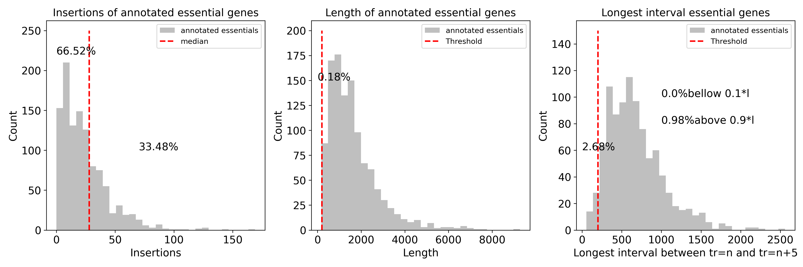
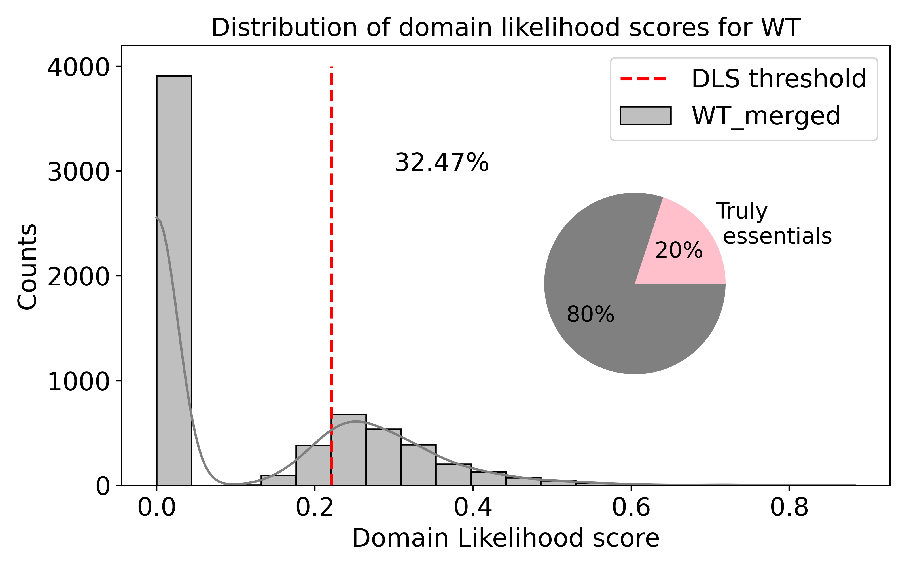

# Domain Likelihood scores 

---

## Using the idea of Benoit in: https://elifesciences.org/articles/23570


---

# Python implementation steps

- Import data 


---

- Take out the genes that have multiple genetic locations : e.g 'ECM1', 'MYO4', 'SSA1', 'RPL30', 'RPL19A', 'PRE8', 'PRE7','RPL19B', 'ELP6', 'ETR1', etc.

- Compute the scores 


---


---

## Implementation of the critical step towards the score


- The largest interval from tr=n to tr=n+t. Example

```python
t=5
vector_insertions=[332164, 332194, 332241, 332294, 332649, 332652, 332700]

vector_insertions[t:]= [332652, 332700]
vector_insertions[:-t]=[332164, 332194]

interval=vector_insertions[t:]-vector_insertions[:-t]=[[488, 506]]

max_interval=max(interval)=506bp

```

---
## How does the DLS score parameters are represented in the annotated essential genes ? 



- it follows that most of the annotated essential genes received a DLS=0.

---

## Summary using the DLS score implementation

