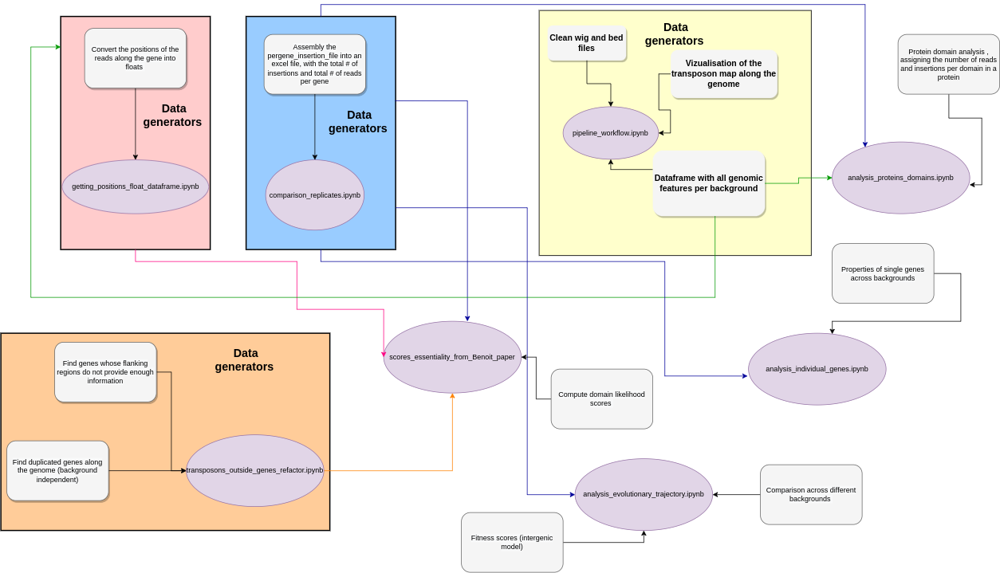

# Workflow of use of the notebooks in this folder

## Flow chart of usage 

## Description of notebooks 

### analysis_evolutionary_trajectory.ipynb   

- Description:

- TO DO:

### making_merged_datasets.ipynb

- Description:

- TO DO:

### analysis_individual_genes.ipynb          

- Description:

- TO DO:

### pipeline_workflow.ipynb

- Description:

- TO DO:

### analysis_proteins_domains.ipynb        

- Description:

- TO DO:

### scores_essentiality_from_Benoit_paper.ipynb

- Description:

- TO DO:

### comparison_replicates.ipynb     

- Description:

- TO DO:    

### transposons_outside_genes_refactor.ipynb

- Description:

- TO DO:

### getting_positions_float_dataframe.ipynb  
- Description:

- TO DO:

### volcano-plots.ipynb

- Description:

- TO DO: